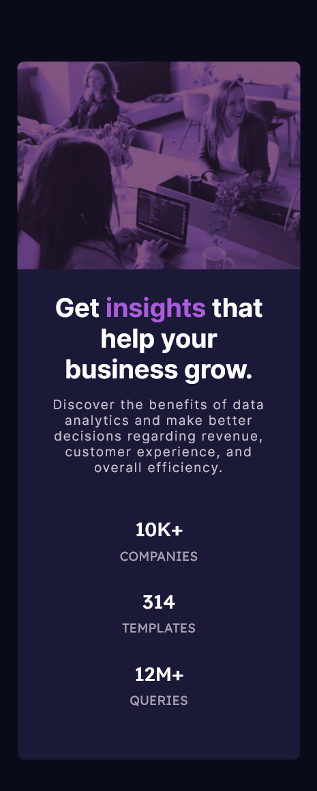

# Stats preview card component solution

This is a solution to the [Stats preview card component challenge on Frontend Mentor](https://www.frontendmentor.io/challenges/stats-preview-card-component-8JqbgoU62).

## Table of contents

## Overview

### The challenge

Users should be able to:

- View the optimal layout depending on their device's screen size

### Screenshot

Desktop implementation:

Mobile implementation:

### Links

- Solution URL: [Solution URL](https://github.com/mariamihai/fm-stats-preview-card-component)
- Live Site URL: [Live site URL](https://mariamihai.github.io/fm-stats-preview-card-component/)

## My process

The designs were created for mobile (375px) and desktop (1440px).

The colors used were the ones provided in the guide of the challenge.

Used [Inter](https://fonts.google.com/specimen/Inter) and [Lexend Deca](https://fonts.google.com/specimen/Lexend+Deca) font families with 15px.

### Built with

- Semantic HTML5 markup
- CSS custom properties
- Flexbox
- Mobile-first workflow

### Useful resources

- [Converting colors](https://convertingcolors.com/) - Convert to different color formats
- [Create filter](https://codepen.io/sosuke/pen/Pjoqqp) - Create a filter similar to the provided color
- [Apply filter](https://css-tricks.com/apply-a-filter-to-a-background-image/)
- [Background blend mode](https://css-tricks.com/almanac/properties/b/background-blend-mode/) - blend `background-image` with its `background-color`

## Author

- Frontend Mentor - [@mariamihai](https://www.frontendmentor.io/profile/mariamihai)
